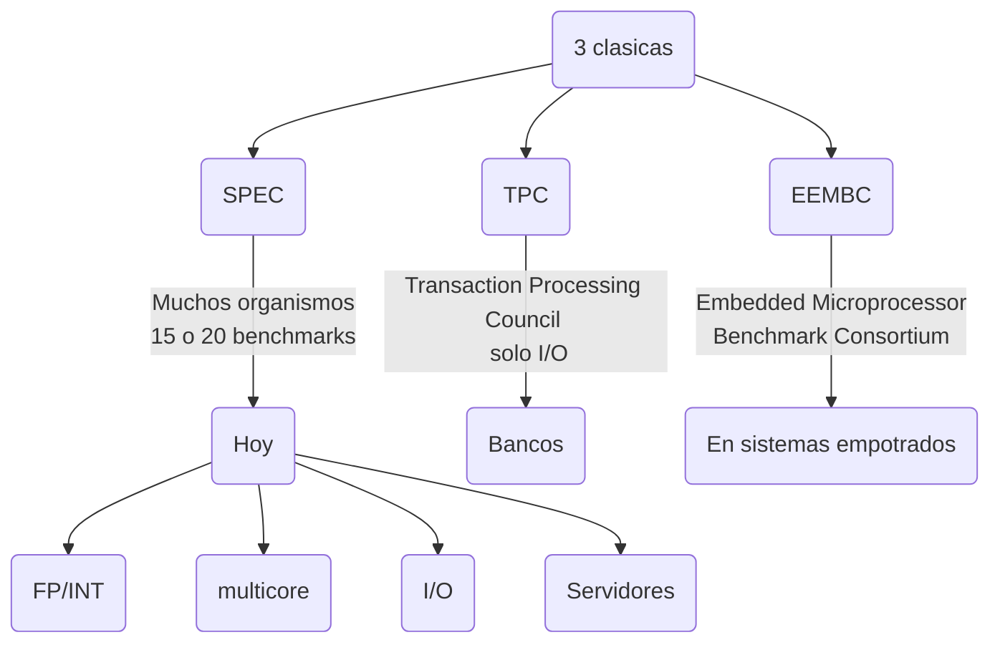
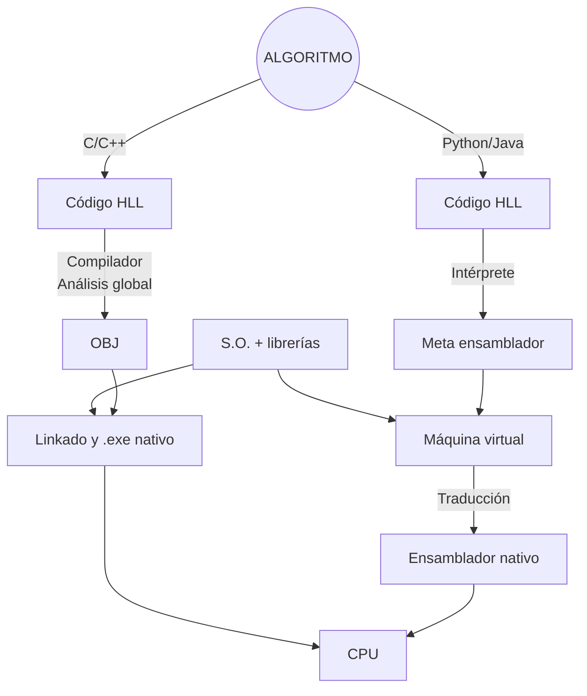

# <mark style="background: #FFF3A3A6;">TEMA 1: Conceptos básicos</mark>
## <mark style="background: #ADCCFFA6;">1. Técnicas estáticas y dinámicas</mark>
- **Estática:** compilador/programador
- **Dinámica:** procesador (runtime)
- **Planificación estática:** reordenar instrucciones o scheduling
- **Planificación dinámica:** algoritmo en hardware, scheduling dinámico

### Ejemplo 1
<hr>
Sea este bucle:
```C
for(i=0; i<M; i++)
	y[i] = x[i] * s;
```
Que traducido a ensamblador sería:
```asm
======= ÚTILES =========================
LF Fx, (Rx)0
MULF
SF (Ry)0, Fy

======= OVERHEAD (inútiles) =============
ADDI           ; i++;
CMPLT          ; i < M;
BNEZ           ; salto para iterar
```

### Ejemplo 2: Planificación
<hr>
Hacer que MULTF y ADDF estén lo más separadas posible.
```asm
LOOP: LF Fx, (Rx)0
	  LF Fy, (Ry)0
	  MULTF Fax, Fx, Fa
	  ADDF Faxy, Fax, Fy
	  SF (Ry)0, Faxy
	  ADDI Rx, Rx, 4
	  ADDI Ry, Ry, 4
	  SLTI Rc, Rx, Rxfin
	  BNEZ Rc, LOOP
```
Código modificado:
```asm
LOOP: LF Fx, (Rx)0
	  MULTF Fax, Fx, Fa
	  LF Fy, (Ry)0
	  ADDI Rx, Rx, 4
	  ADDI Ry, Ry, 4
	  SLTI Rc, Rx, Rxfin
	  ADDF Faxy, Fax, Fy
	  SF (Ry)-4, Faxy
	  BNEZ Rc, LOOP
```

## <mark style="background: #ADCCFFA6;">2. Leyes y principios. Rendimiento y productividad</mark>

### $t_{CPU,Sync}=n_{ciclos}\times{T_{CLK}}$
### $t_{CPU,Pipeline}=CPI\times{T_{CLK}}\times{n_{instrucciones}}$
### $CPI=\frac{n_{ciclos}}{n_{instrucciones}}$
### $Rend.=\frac{1}{t_{CPU}}\rightarrow Arquitectura~~\downarrow$
### $Productividad = \frac{Nº tareas}{S}\rightarrow SO/BD~ (mucha~I/O)$
### $Ac_{A-B}=\frac{t_{CPU,A}}{t_{CPU,B}}\geq 1.0$

Razonar las siguientes afirmaciones:
1. Mas rendimiento $\rightarrow$ más productividad. <span style="color:green;">Verdad</span>
2. Más productividad $\rightarrow$ más rendimiento. <span style="color:red;">Falso</span>
3. Más máquinas en paralelo $\rightarrow$ más rendimiento. <span style="color:red;">Falso</span>
4. Más máquinas en paralelo $\rightarrow$ más productividad. <span style="color:green;">Verdad</span>

![[Pasted image 20240930084659.png]]
### Sobre el CPI...
- El CPI aumenta si la máquina **NO** está optimizada. Pero **SI LO ESTÁ**, el CPI ideal se vuelve 1.
- Hoy en día el CPI es **NO ADITIVO**, y suele ser $\lt{1}$. Para calcularlo, se suele usar el caso peor (bottleneck).
Existen "tipos" de CPI:
- $CPI_{datos}\equiv$ Dependencias
- $CPI_{estructural}\equiv$ Bloqueos porque todos los recursos (U.F.) están en uso.
- $CPI_{control}~(flujo)~\equiv$ Saltos buscan instrucción siguiente $\rightarrow$ rompe la cadena. 
- $CPI_{memoria}\equiv$ Memoria RAM lenta. Favorecen el cacheado eficiente.

### <mark style="background: #FFB86CA6;">Ley de Amdahl</mark>
Lo importante de la Fracción del sistema es dónde se puede optimizar y no tanto la aceleración parcial.
![[Pasted image 20240916121903.png|350]]
### $t_{CPU,inicial}=1$
### $t_{CPU,final}=(1-F)+\frac{F}{A_{P}}$

### $A_{total}=\frac{t_{CPU,inicial}}{t_{CPU,final}}$

### <mark style="background: #FFB86CA6;">Ley 10/90 (Principio de localidad)</mark>

**Nota**
>10% programa contiene el 90% del $t_{CPU}$ 

Gracias al principio de localidad las cachés funcionan. Comparando el principio en datos e instrucciones:
- Instrucciones: se cumple muy bien excepto en los saltos. MR casi 1% en caché $L1_{instrucciones}$. 
- Datos: se cumple peor. MR casi 5-10% en $L1_{datos}$.
Existen localidad temporal y espacial:
- Temporal: si se acede a una dirección, pronto se accederá otra vez.
- Espacial: si se accede a D, también se accederá eventualmente a D+1, D+2... (bloque o línea de caché). 
### <mark style="background: #FFB86CA6;">Otras medidas de rendimiento</mark>
<div class="nota"><h4>NOTA</h4><p>Todas pueden tener el prefijo correspondiente a la magnitud (Tera, Giga, Mega...)</p></div>
**IPS (Instrucciones Por Segundo)**
**FLOPs (Floating Point OPerations)**:
- Sólo + - / * y trascendentes (todos valor 1 FLOP)
- Para código científico/multimedia (ejemplo TFLOPs en GPUs)
**FMA (Fused Multiply Add)**: $SAXPY\Rightarrow a*\vec{x}+\vec{y}$
**MACS (Multiply-ACcumulate)**: $Sumatorio\Rightarrow a=a+b*c$
### <mark style="background: #FFB86CA6;">Rendimiento de máquina (comparativa)</mark>
 <div class="nota">
	 <h4>NOTA</h4>
	 <p>La media aritmética castiga un valor bajo. El cociente de la media de N tiempos es igual a la media de aceleraciones. La media aritmética no cumple con esto.</p>
	 <p>Se pueden comparar dos máquinas respecto a otra de referencia, normalizando respecto a la media geométrica de referencia (nunca la aritmética)</p>
	 
 </div>
Colecciones de benchmarks:

### <mark style="background: #FFB86CA6;">Ley de Moore (1965, Intel)</mark>
 La tecnología aumenta cierto porcentaje cada año (cada 3 años se multiplica por 4 el número de transistores).
 ![[Ley_de_Moore.png]]
### <mark style="background: #FFB86CA6;">Lenguajes compilados VS interpretados</mark>

# <mark style="background: #FFF3A3A6;">TEMA 3: Paralelismo a nivel de instrucciones (ILP)</mark>
## <mark style="background: #ADCCFFA6;">1. Técnicas de planificación dinámicas</mark>
### $t_{CPU}=N_{instr}\times CPI\times T_{CLK}$

1. Para reducir el $N_{instr}$ lo que obtenemos es una máquina VLIW (Very Long Instruction Word), en la que usamos macroinstrucciones (128 ó 256 bits). En estas máquinas hay muchas instrucciones RISC. Si hay operaciones **SIN** dependencia $\Rightarrow$ La reordenación depende del compilador.
2. Si reducimos el $CPI$, obtenemos máquinas superescalares donde por cada ciclo se ejecutan varias instrucciones
$$\begin{equation}
CPI = \frac{1}{m}, m\equiv grado~de~escalaridad
\end{equation}
$$
3. El bajar el $T_{CLK}$, a día de hoy se ha saturado la frecuencia. <u>Truco</u>: superpipeline/superencadenamiento.
	![[Imagen de WhatsApp 2024-10-09 a las 21.20.30_7d2eb4f4.jpg|500]]
	La lectura es doble porque $m=2$. Múltiples puertos (AB, DB).

<u>Pág 15</u>
![[Imagen de WhatsApp 2024-10-09 a las 21.34.14_bd89b69c.jpg|500]]
Con técnicas dinámicas se anotan las RAWs, por lo que sólo hay ciclos de espera de las instrucciones dependientes:
![[Imagen de WhatsApp 2024-10-09 a las 21.39.25_22abea24.jpg|500]]
El **algoritmo de Tomasulo (1967)** es un algoritmo distribuido que anota las dependencias reales en las RS (Reservation Station).
![[Imagen de WhatsApp 2024-10-09 a las 22.00.36_cbfd6ee8.jpg|500]]
El contenido de las RS está formateado  de la siguiente forma:
![[Imagen de WhatsApp 2024-10-09 a las 22.05.13_e4102573.jpg|500]]
### <mark style="background: #FFB86CA6;">5 casos de bloqueo</mark>
1. Muchos RAW (como ADD o MUL).
	$\frac{duracion}{iteracion}=duración~de~ADD~ó~MUL~(EX+WB)$
5. UF no segmentada (no permite encadenamiento). Normalmente con instrucciones complejas como DIV, SQRT, LOG, TRIGON, aunque no haya RAWs.
2. Balanceo de UF respecto a tipos de instrucción (no importan las RAWs).
	- Acceso a memoria
	- Todo INT
	- Matemática en la GPU
3. (y 4.) son casos estadísticos:
	4. Depende del % de aciertos del predictor de saltos ó **BTB (Branch Target Buffer)**. Si no falla es muy probable que el CPI sea ideal. Si hay al menos 1 fallo del BTB: se vacían las colas de instrucciones (ABORT $\rightarrow$ `AB`).
$$
\begin{equation}
CPI_{BLOQ}=\frac{ciclos_{BLOQ}}{1~fallo~predicción}\times\frac{F~fallos}{100~saltos}\times\frac{K~saltos}{100~instrucciones}
\end{equation}
$$
