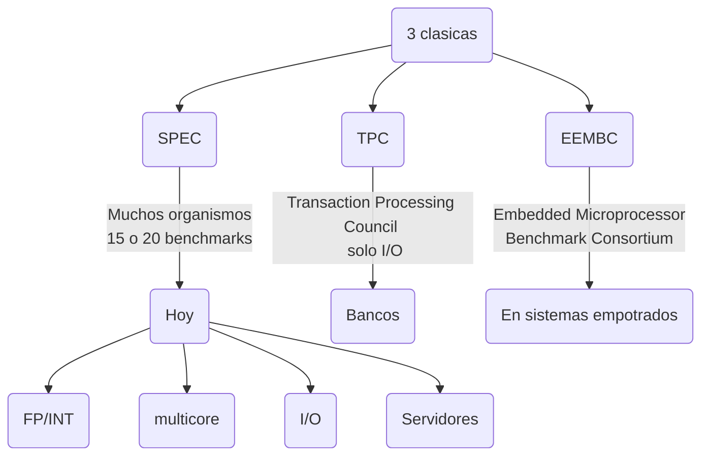
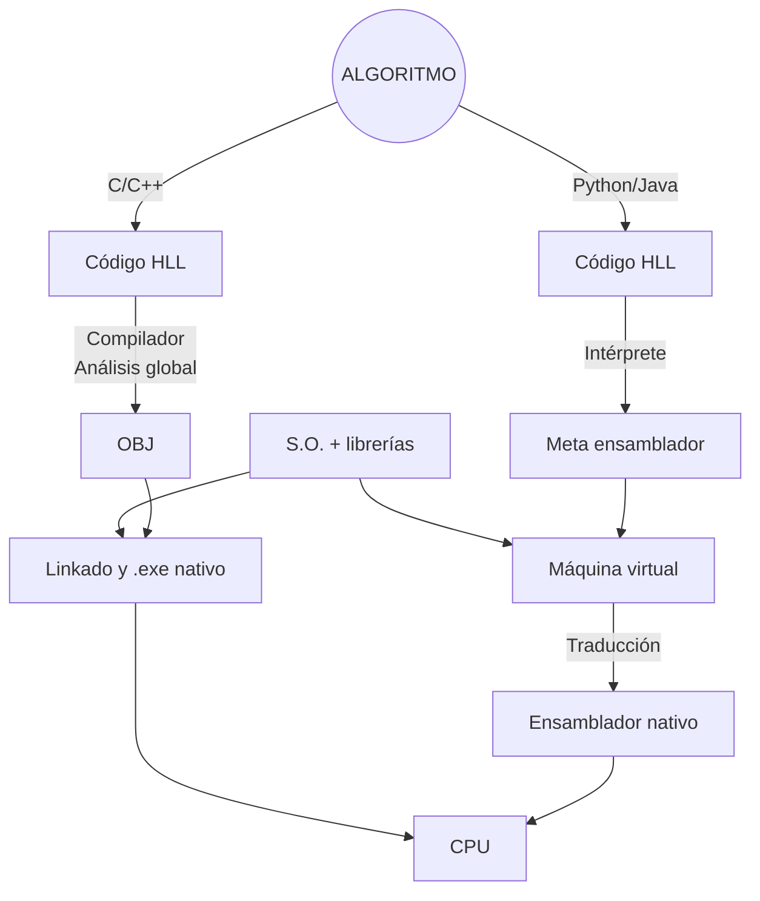

# <mark style="background: #FFF3A3A6;">TEMA 1: Conceptos básicos</mark>
## <mark style="background: #ADCCFFA6;">1. Técnicas estáticas y dinámicas</mark>
- **Estática:** compilador/programador
- **Dinámica:** procesador (runtime)
- **Planificación estática:** reordenar instrucciones o scheduling
- **Planificación dinámica:** algoritmo en hardware, scheduling dinámico

### Ejemplo 1
<hr>
Sea este bucle:
```C
for(i=0; i<M; i++)
	y[i] = x[i] * s;
```
Que traducido a ensamblador sería:
```asm
======= ÚTILES =========================
LF Fx, (Rx)0
MULF
SF (Ry)0, Fy

======= OVERHEAD (inútiles) =============
ADDI           ; i++;
CMPLT          ; i < M;
BNEZ           ; salto para iterar
```

### Ejemplo 2: Planificación
<hr>
Hacer que MULTF y ADDF estén lo más separadas posible.
```asm
LOOP: LF Fx, (Rx)0
	  LF Fy, (Ry)0
	  MULTF Fax, Fx, Fa
	  ADDF Faxy, Fax, Fy
	  SF (Ry)0, Faxy
	  ADDI Rx, Rx, 4
	  ADDI Ry, Ry, 4
	  SLTI Rc, Rx, Rxfin
	  BNEZ Rc, LOOP
```
Código modificado:
```asm
LOOP: LF Fx, (Rx)0
	  MULTF Fax, Fx, Fa
	  LF Fy, (Ry)0
	  ADDI Rx, Rx, 4
	  ADDI Ry, Ry, 4
	  SLTI Rc, Rx, Rxfin
	  ADDF Faxy, Fax, Fy
	  SF (Ry)-4, Faxy
	  BNEZ Rc, LOOP
```

## <mark style="background: #ADCCFFA6;">2. Leyes y principios. Rendimiento y productividad</mark>

### $t_{CPU,Sync}=n_{ciclos}\times{T_{CLK}}$
### $t_{CPU,Pipeline}=CPI\times{T_{CLK}}\times{n_{instrucciones}}$
### $CPI=\frac{n_{ciclos}}{n_{instrucciones}}$
### $Rend.=\frac{1}{t_{CPU}}\rightarrow Arquitectura~~\downarrow$
### $Productividad = \frac{Nº tareas}{S}\rightarrow SO/BD~ (mucha~I/O)$
### $Ac_{A-B}=\frac{t_{CPU,A}}{t_{CPU,B}}\geq 1.0$

Razonar las siguientes afirmaciones:
1. Mas rendimiento $\rightarrow$ más productividad. <span style="color:green;">Verdad</span>
2. Más productividad $\rightarrow$ más rendimiento. <span style="color:red;">Falso</span>
3. Más máquinas en paralelo $\rightarrow$ más rendimiento. <span style="color:red;">Falso</span>
4. Más máquinas en paralelo $\rightarrow$ más productividad. <span style="color:green;">Verdad</span>

![[Pasted image 20240930084659.png]]
### Sobre el CPI...
- El CPI aumenta si la máquina **NO** está optimizada. Pero **SI LO ESTÁ**, el CPI ideal se vuelve 1.
- Hoy en día el CPI es **NO ADITIVO**, y suele ser $\lt{1}$. Para calcularlo, se suele usar el caso peor (bottleneck).
Existen "tipos" de CPI:
- $CPI_{datos}\equiv$ Dependencias
- $CPI_{estructural}\equiv$ Bloqueos porque todos los recursos (U.F.) están en uso.
- $CPI_{control}~(flujo)~\equiv$ Saltos buscan instrucción siguiente $\rightarrow$ rompe la cadena. 
- $CPI_{memoria}\equiv$ Memoria RAM lenta. Favorecen el cacheado eficiente.

### <mark style="background: #FFB86CA6;">Ley de Amdahl</mark>
Lo importante de la Fracción del sistema es dónde se puede optimizar y no tanto la aceleración parcial.
![[Pasted image 20240916121903.png|350]]
### $t_{CPU,inicial}=1$
### $t_{CPU,final}=(1-F)+\frac{F}{A_{P}}$

### $A_{total}=\frac{t_{CPU,inicial}}{t_{CPU,final}}$

### <mark style="background: #FFB86CA6;">Ley 10/90 (Principio de localidad)</mark>

**Nota**
>10% programa contiene el 90% del $t_{CPU}$ 

Gracias al principio de localidad las cachés funcionan. Comparando el principio en datos e instrucciones:
- Instrucciones: se cumple muy bien excepto en los saltos. MR casi 1% en caché $L1_{instrucciones}$. 
- Datos: se cumple peor. MR casi 5-10% en $L1_{datos}$.
Existen localidad temporal y espacial:
- Temporal: si se acede a una dirección, pronto se accederá otra vez.
- Espacial: si se accede a D, también se accederá eventualmente a D+1, D+2... (bloque o línea de caché). 
### <mark style="background: #FFB86CA6;">Otras medidas de rendimiento</mark>
<div class="nota"><h4>NOTA</h4><p>Todas pueden tener el prefijo correspondiente a la magnitud (Tera, Giga, Mega...)</p></div>
**IPS (Instrucciones Por Segundo)**
**FLOPs (Floating Point OPerations)**:
- Sólo + - / * y trascendentes (todos valor 1 FLOP)
- Para código científico/multimedia (ejemplo TFLOPs en GPUs)
**FMA (Fused Multiply Add)**: $SAXPY\Rightarrow a*\vec{x}+\vec{y}$
**MACS (Multiply-ACcumulate)**: $Sumatorio\Rightarrow a=a+b*c$
### <mark style="background: #FFB86CA6;">Rendimiento de máquina (comparativa)</mark>
 <div class="nota">
	 <h4>NOTA</h4>
	 <p>La media aritmética castiga un valor bajo. El cociente de la media de N tiempos es igual a la media de aceleraciones. La media aritmética no cumple con esto.</p>
	 <p>Se pueden comparar dos máquinas respecto a otra de referencia, normalizando respecto a la media geométrica de referencia (nunca la aritmética)</p>
	 
 </div>
Colecciones de benchmarks:

### <mark style="background: #FFB86CA6;">Ley de Moore (1965, Intel)</mark>
 La tecnología aumenta cierto porcentaje cada año (cada 3 años se multiplica por 4 el número de transistores).
 ![[Ley_de_Moore.png]]
### <mark style="background: #FFB86CA6;">Lenguajes compilados VS interpretados</mark>

# <mark style="background: #FFF3A3A6;">TEMA 3: Instruction Level Parallelism (ILP)</mark>
## <mark style="background: #ADCCFFA6;">1. Técnicas de planificación dinámicas</mark>
### $t_{CPU}=N_{instr}\times CPI\times T_{CLK}$

1. Para reducir el $N_{instr}$ lo que obtenemos es una máquina VLIW (Very Long Instruction Word), en la que usamos macroinstrucciones (128 ó 256 bits). En estas máquinas hay muchas instrucciones RISC. Si hay operaciones **SIN** dependencia $\Rightarrow$ La reordenación depende del compilador.
2. Si reducimos el $CPI$, obtenemos máquinas superescalares donde por cada ciclo se ejecutan varias instrucciones
$$\begin{equation}
CPI = \frac{1}{m}, m\equiv grado~de~escalaridad
\end{equation}
$$
3. El bajar el $T_{CLK}$, a día de hoy se ha saturado la frecuencia. <u>Truco</u>: superpipeline/superencadenamiento.
	![[Imagen de WhatsApp 2024-10-09 a las 21.20.30_7d2eb4f4.jpg|500]]
	La lectura es doble porque $m=2$. Múltiples puertos (AB, DB).

<u>Pág 15</u>
![[Imagen de WhatsApp 2024-10-09 a las 21.34.14_bd89b69c.jpg|500]]
Con técnicas dinámicas se anotan las RAWs, por lo que sólo hay ciclos de espera de las instrucciones dependientes:
![[Imagen de WhatsApp 2024-10-09 a las 21.39.25_22abea24.jpg|500]]
El **algoritmo de Tomasulo (1967)** es un algoritmo distribuido que anota las dependencias reales en las RS (Reservation Station).
![[Imagen de WhatsApp 2024-10-09 a las 22.00.36_cbfd6ee8.jpg|500]]
El contenido de las RS está formateado  de la siguiente forma:
![[Imagen de WhatsApp 2024-10-09 a las 22.05.13_e4102573.jpg|500]]
### <mark style="background: #FFB86CA6;">5 casos de bloqueo</mark>
1. Muchos RAW (como ADD o MUL).
	$\frac{duracion}{iteracion}=duración~de~ADD~ó~MUL~(EX+WB)$
2. Balanceo de UF respecto a tipos de instrucción (no importan las RAWs).
	- Acceso a memoria
	- Todo INT
	- Matemática en la GPU
3. Fallos en caché. Un fallo en Ln provoca un $t_{latencia}$ para capturar el primer bit de Ln+1 y luego un $t_{rafaga}~\alpha\frac{1}{AB}$ para capturar la línea/bloque: NO PIPELINE. Muchas esperas provocan bloqueo por agotamiento de RS.
$$
\begin{equation}
CPI_{DATOS}=\frac{P~ciclos~(penalidad~por~fallo)}{1~fallo}\times\frac{F~fallos}{100~accesos}\times\frac{N~accesos~a~M_{DATOS}}{100~instrucciones}
\end{equation}
$$
4. Depende del % de aciertos del predictor de saltos ó **BTB (Branch Target Buffer)**. Si no falla es muy probable que el CPI sea ideal. Si hay al menos 1 fallo del BTB: se vacían las colas de instrucciones (ABORT $\rightarrow$ `AB`).
$$
\begin{equation}
CPI_{BLOQ}=\frac{ciclos_{BLOQ}}{1~fallo~predicción}\times\frac{F~fallos}{100~saltos}\times\frac{K~saltos}{100~instrucciones}
\end{equation}
$$
	**Estructura del BTB:** una "caché" que predice la dirección del salto con la dirección desde el PC usando una máquina de estados de 2b. Se puede mejorar el funcionamiento usando una máquina con correlación que usa un historial de saltos para evitar los fallos de la máquina simple.
5. UF no segmentada (no permite encadenamiento). Normalmente con instrucciones complejas como DIV, SQRT, LOG, TRIGON, aunque no haya RAWs.
6. Dependencias RAW a través de memoria. 
	```asm
	SW (R1)0,R7
	LW R9,(R6)8
	```
	Si R1 == R6+8 se produce una RAW.
### <mark style="background: #FFB86CA6;">Especulación y el problema de las Interrupciones</mark>
Al planificar dinámicamente, suelen aparecer instrucciones especulativas que se pueden llegar a ejecutar antes de que se aborte la instrucción por demasiada espera. 
```asm
IF IS o  o  o  o  o  o EX WB
   IF IS EX WB            AB
   IF IS o  o  EX WB      AB
   SW     ...  EX
              (mem)
```
Estas escriben en registros y memoria antes de abortarse y es un problema. También hay problemas si hay interrupciones, por eso interesa que toda instrucción **se termine en orden**. Para solucionarlo se implementa un **ROB (ReOrder Buffer)** con una cola FIFO para que estén ordenadas. Al final de las fases "normales" del pipeline aparece una fase `CM (commit)` cuyo propósito es mantener el orden. En cuanto haya fallo de predicción, no realizan la fase `CM` y la cola FIFO se vacía.

- GPP -> superescalares, planificación dinámica y ROB
- Embedded -> superescalares, sin planififación dinámica. <u>Caso típico</u>: $m=2$ `INT` y `FP`. Interesa que el compilador empareje INT/FP para que no haya dependencias reales.
## <mark style="background: #ADCCFFA6;">2. Implementación superescalares (p. dinámica)</mark>
- **Fase IF:** IFU Instruction Fetch Unit. Cola independiente que buscan $m$ o más instrucciones por ciclo y preparan las $m$ instrucciones siguientes para `IS`.
- **Fase IS:** más compleja (bottleneck). Emite las $m$ instrucciones mientras haya RS libres. 
- **Fase EX:** total UF > $m$ y doble puerto.
- **Fase WB:** nº de CDBs y puertos del fichero de registros proporcional a $m$.
# <mark style="background: #FFF3A3A6;">TEMA 4: Data Level Parallelism (DLP)</mark>
## <mark style="background: #ADCCFFA6;">1. Set de instrucciones SIMD</mark>
Registro SIMD (MMX Intel, AVX AMD).
![[Imagen de WhatsApp 2024-12-01 a las 17.20.40_e72cdcba.jpg|300]]
![[Imagen de WhatsApp 2024-12-01 a las 17.20.58_65b04e33.jpg|300]]
### <mark style="background: #FFB86CA6;">Instrucciones aritméticas</mark>
Se añade un suffix que indica vectorización. Hay 4 tipos de suffix dependiendo de:
![[Imagen de WhatsApp 2024-12-01 a las 17.43.54_e82058e0.jpg|400]]
#### <mark style="background: #ABF7F7A6;">Ejemplo</mark>
![[Imagen de WhatsApp 2024-12-01 a las 17.21.22_99f7757f.jpg|250]]
```asm
addps MM2, MM1, MM3
addpd MM7, ...
```
### <mark style="background: #FFB86CA6;">Operaciones lógicas</mark>
```asm
andps  MM2, MM1, MMmask ---> MMmask = 0x7FFFFFFF, signo: 0 (+)
orpd
xorps  MMX, MMX, MMmask ---> MMmask = 0x80000000, cambia signo
xnorps ...
notpd  ...
```
### <mark style="background: #FFB86CA6;">Instrucciones de comparación (generan máscaras)</mark>
`cmptgtss MMmask, MM2, MM4`
![[Imagen de WhatsApp 2024-12-01 a las 17.21.42_81ca5180.jpg|250]]
### <mark style="background: #FFB86CA6;">Instrucciones de acceso a memoria</mark>
Movimientos de 128 bits (`ldps`, `stpd`). Conviene tener alineamiento: 128 bits (16B) $\rightarrow$ `Rx $ 16 = 0`.
### <mark style="background: #FFB86CA6;">Instrucciones de "shuffle" de elementos</mark>
```
shufps MMfd, MMf, MMmask
shufpd ...
```
La única instrucción de este tipo que es "útil" es: `shufps MM1, MM1, a` que es para replicar `a` en todos.
#### <mark style="background: #ABF7F7A6;">Ejemplo: DAXPY</mark>
![[Imagen de WhatsApp 2024-12-01 a las 17.22.01_a68c21f3.jpg|500]]
#### <mark style="background: #ABF7F7A6;">Ejemplo: Sumatorio</mark>
![[Imagen de WhatsApp 2024-12-01 a las 17.22.17_9d40634d.jpg|500]]
<span style="color:red;">Truco: poner a '0' un registro: <code>xorpd MMS, MMS, MMS</code></span>
## <mark style="background: #ADCCFFA6;">2 .Procesado condicional</mark>
La vectorización es incompatible con las sentencias `if/else` hay que hacerlas desaparecer. Se usa la ejecución predicativa de forma: `[COND] INSTRUCCIÓN`
1. Generar V's
2. Generar F's
3. Compactar con máscaras

![[Pasted image 20241201180415.png|400]]
![[Pasted image 20241201180451.png]]
## <mark style="background: #ADCCFFA6;">3. Modelo del tejado (Roofline Model)</mark>
$$ \begin{equation}
GLFOPS=\frac{Nº~FLOPS}{10^9·t_{CPU}}=D_A·AB_{RAM}=\frac{Nº~FLOPS}{1~Byte}·\frac{1~GB}{1~s}
\end {equation} $$
$$ \begin{equation}
\log{(GFLOPS)}=\log{(AB_{RAM})}+1·\log{(D_A)}\text{ queda de la forma: y=ax+b}
\end {equation} $$
![[Imagen de WhatsApp 2024-12-01 a las 17.23.41_327415e6.jpg|]]
A tener en cuenta:
- 2 UF
- Núcleo vectorial AVX (256 bits = 8 x 32 float)
- $\frac{2x8~FLOPS}{1~ciclo}·\frac{F~Gciclos}{1~s}·\text{12 cores en ||}=3GHz=16·3·12~GFLOPS~(techo)$

Siendo la densidad aritmética ideal:
$D_{A,ideal}=\frac{\text{GFLOPS techo}}{AB_{RAM}}=\frac{16·3·12}{48}=12$
# <mark style="background: #FFF3A3A6;">TEMA 5: Thread Level Parallelism (TLP)</mark>
### <mark style="background: #FFB86CA6;">Puntos débiles de un sistema multicore</mark>
- Difícil analizar si una app es paralelizable.
- Difícil de hacer DEBUG
- Pensar en vectorial es difícil
- Si el dato es remoto ("sale del computador") $\Rightarrow$ alta latencia (ms).
## <mark style="background: #ADCCFFA6;">1. Taxonomía de Flynn. Taxonomía según la MP.</mark>
Single/Multiple Instruction/Data flows:
- SISD
- SIMD
- MISD
- MIMD
Si atendemos a cómo se organiza la memoria principal (MP):
![[Imagen de WhatsApp 2024-12-02 a las 19.14.00_a8876db6.jpg|400]]
- **UMA (Uniform Memory Access):** 
	- Tiempo de acceso uniforme para toda dirección.
	- También se llaman Multiprocesadores Simétricos  (SMP).
	- Casi todos los multicore actuales son así.
	- Hay cuello de botella en el acceso a memoria.
- **NUMA (Non Uniform Memory Access):** 
	- Tiempo de acceso no uniforme.
	- Compatible con UMA.
- **MPM (Message Passing Machine):**
	- Espacio de direcciones distribuido.
	- Cada CPU es un computador independiente.
	- Escalabilidad fácil excepto en el ancho de banda de lectura (en memoria).
	- Comunicación por mensajes (como el S.O.)
<div class="nota"><h4>Escalabilidad</h4><p>Un concepto es escalable si al crecer <strong>p</strong> (nº CPUs), crece al menos tanto como <strong>p</strong>.</p></div>
## <mark style="background: #ADCCFFA6;">2. Herramientas de programación: OpenMP</mark>
- Espacio de direcciones compartido
- Paralelismo "incremental" porque se van añadiendo directivas `#pragma omp ...`
- Modelo de programación  SPMD (Single Program Multiple Data).
  ![[Imagen de WhatsApp 2024-12-02 a las 19.20.38_10d0403a 1.jpg]]
  Cada hilo lleva un `tid`, que lo identifica:
  ![[Imagen de WhatsApp 2024-12-02 a las 19.21.18_1bf4e996.jpg|500]]  
### <mark style="background: #FFB86CA6;">Puntos clave para el diseño de una app</mark>
1. Buscar regiones paralelas (mucho DLP)
2. Insertar directivas (`#pragma omp ...`) para especificar el reparto de tareas entre hilos
3. Comunicación y sincronización entre hilos
4. "Revolución": modificar DSA si no hay buen paralelismo
### <mark style="background: #FFB86CA6;">Directivas de la librería OpenMP</mark>
`omp_set_num_threads(nth);` -> establece el número de hilos a usar
`omp_get_num_threads();` -> obtiene el número de hilos actual
`omp_get_thread_num();` -> obtiene el `tid` del hilo en uso
![[Imagen de WhatsApp 2024-12-02 a las 19.25.01_a3ba0084.jpg|400]]
![[Imagen de WhatsApp 2024-12-02 a las 19.25.30_3a3bec91.jpg]]
<div class="warn"><h4>Detalle</h4><p>Toda variable compartida puede dar lugar a problemas de coherencia en Memoria Caché.</p></div>
### <mark style="background: #FFB86CA6;">Planificación de Tareas: SCHEDULE</mark>
Hay diferentes formas de asignar iteraciones a hilos:
- `schedule(static[,chunk])`: "chunk" iteraciones se asignan de manera estática a los hilos en _round-robin_.
- `schedule(dynamic[,chunk])`: cada hilo toma "chunk" iteraciones cada vez que está sin trabajo.
- `schedule(guided[,chunk])`: cada hilo toma progresivamente menos iteraciones (dinámicamente) hasta "chunk".

![[Pasted image 20241202205510.png|400]]
Hay algunas diferencias notables entre **static** y **dynamic**:
- **Static:** menos coste / mejor localidad de datos
- **Dynamic:** más coste / carga más equilibrada
### <mark style="background: #FFB86CA6;">Reparto de tareas</mark>
1. Directiva **`for`**: se pone dentro de una sección **`omp parallel`**. Reparte la ejecución de un bucle entre todos los hilos.
2. Directiva **`sections`**: para definir "manualmente" trozos o secciones de una región paralela a repartir entre hilos en función de su `tid`.
3. Directiva **`single`**: para definir un trozo de código que sólo lo debe ejecutar un hilo.
### <mark style="background: #FFB86CA6;">Sincronización</mark>
Los hilos se detienen hasta que alcancen la barrera (`#pragma omp barrier`).
<div class="nota"><h4>NOTA</h4><p><code>#pragma parallel for</code> introduce una barrera de forma implícita</p></div>
### <mark style="background: #FFB86CA6;">Secciones críticas y actualizaciones atómicas</mark>
Si los hilos se comunican con variables compartidas, y estas se usan mal, se originan condiciones de carrera (data-race). Se intenta sincronizar para evitarlas, pero poco, ya que la sincronización es costosa. Para definir la sección crítica se usa la directiva `#pragma omp critical`.
## <mark style="background: #ADCCFFA6;">3. Herramientas de programación: MPI</mark>
Message Passing Interface o MPI, es una especificación para paso de mensajes. Algunas ventajas al usar MPI son:
- Es estándar en HPC
- Es portable
- Funcionalidad (alrededor de 115 rutinas)
Las principales implementaciones son OpenMPI, MPI-CH, LAMMPI.
### <mark style="background: #FFB86CA6;">Modelo SPMD de programación</mark>
Un único fichero de código, una copia del ejecutable en cada nodo (incluye bifurcaciones según el `PID`). También puede haber un **mpd daemon** que se ejecuta en cada nodo del cluster y espera envío de procesos a estos para levantarlos.
### <mark style="background: #FFB86CA6;">Inicialización y terminación</mark>
- Se incluye en el header `mpi.h`.
- `int MPI_Init(int* argc, char*** argv)`
	- debe ser la primera llamada (y sólo una vez)
	- inicializa el entorno de ejecución
	- arc y argv son del main
- `int MPI_Finalize(void)`
	- termina el entorno de ejecución de MPI
	- debe ser la última rutina de MPI
- `int MPI_Comm_size(MPI_COMM_WORLD, int* totTasks)`
	- devuelve el número de procesos en el grupo (_comunicador_ MPI) en `totTasks`
- `int MPI_Comm_rank(MPI_COMM_WORLD, int* task_id)`
	- devuelve el rango (id) del proceso actual (de 0 a `totTasks`-1) en `task_id`.
Aproximadamente todos los mensajes de MPI tienen:
- **buff**: el puntero a enviar
- **count**: el numero de unidades
- **MPI_TYPE**: el tipo de variables
- **source/dest**: ID de proceso donde llega o de donde viene
- **tag**: etiqueta del mensaje
- **comm**: ID del grupo de procesos (_comunicador_)
- **status**: chequea si el mensaje fue correcto
### <mark style="background: #FFB86CA6;">Mensajes simples: de uno a uno</mark>
- `int MPI_Send(void* buf, int count, MPI_Datatype datatype, int dest, int tag, MPI_Comm comm)`
	- envío básico **BLOQUEANTE**.
	- la rutina retorna cuando el buffer de la app está libre
	- existe `MPI_Isend` **NO BLOQUEANTE**
- `int MPI_Recv(void* rbuf, int count, MPI_Datatype datatype, int source, int tag, MPI_Comm comm, MPI_Status* status)`
	- recibe un mensaje (**BLOQUEANTE**)
	- existe `MPI_Irecv` **NO BLOQUEANTE**
<div class="warn"><h4>/!\ ATENCIÓN /!\</h4><p>Puede ocurrir un <strong>INTERBLOQUEO</strong> (deadlock) si se intenta hacer <code>MPI_Recv(...)</code> sin mandar un mensaje con <code>MPI_Send(...)</code></p></div>
### <mark style="background: #FFB86CA6;">Comunicación colectiva</mark>
Similar a OpenMP pero con más operaciones. Movimiento colectivo de datos. Hay varios tipos: 
- **Broadcast:** desde un proceso al resto de procesos.
  `int MPI_Bcast(void* buff, int count, MPI_Datatype datatype, int root, MPI_Comm comm)`
  ![[Pasted image 20241202213404.png|400]]
- **Scatter:** distribuye distintos mensajes de un proceso al resto. Un proceso **root** debe tener un buffer con `sendcnt*p` elementos. Lo habitual es: `sendcnt = recvcnt`.
  `int MPI_Scatter(void* sendbuf, int sendcnt, MPI_Datatype sendtype, void* recvbuf, int recvcnt, MPI_Datatype recvtype, int root, MPI_Comm comm)`
  ![[Pasted image 20241202213603.png|400]]
  - **Gather:** recoge distintos mensajes de cada proceso en un único proceso destino. Es la contraria de `MPI_Scatter`.    ![[Pasted image 20241202214114.png|600]]
- **Allgather:** concatena los datos de todos los procesos. Cada proceso realiza un broadcast uno-a-todos.
  ![[Pasted image 20241202214247.png|400]]
#### <mark style="background: #D2B3FFA6;">Esquema Scatter-Gather</mark>
Se suele usar el esquema **Scatter-Gather**
![[Pasted image 20241202214411.png]]
### <mark style="background: #FFB86CA6;">Reducciones: MPI_Reduce</mark>
`int MPI_Reduce(const void* sendbuf, void* recvbuf, int count, MPI_Datatype datatype, MPI_Op op, int root, MPI_Comm comm)`
## <mark style="background: #ADCCFFA6;">4. Caracterización de aplicaciones</mark>
